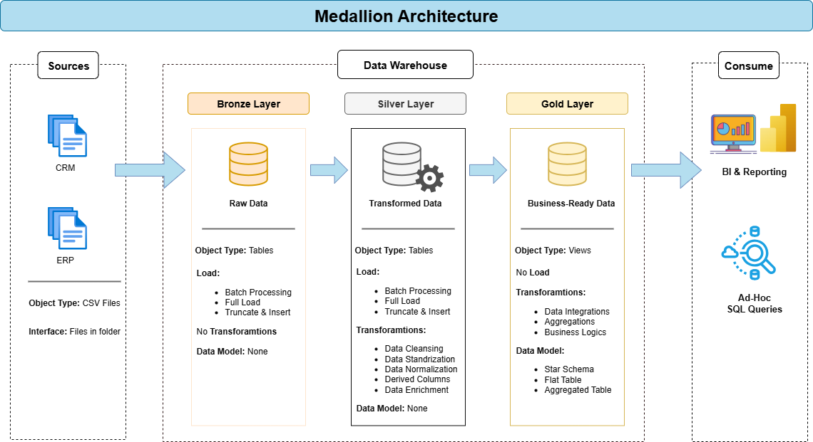

# 🧠 Modern Data Warehouse with SQL Server using Medallion Architecture

## 📋 Project Overview

This project focuses on building a **modern data warehouse** using **SQL Server** and the **Medallion Architecture** framework, structured into **Bronze**, **Silver**, and **Gold** layers. It demonstrates the complete lifecycle of a data solution—from raw data ingestion to analytics and reporting.

### Key Components

- **Data Architecture:** Design and implementation of a scalable **modern data warehouse** following the **Medallion Architecture** (Bronze, Silver, Gold).  
- **ETL Pipelines:** Development of robust **Extract, Transform, and Load (ETL)** processes to ingest and prepare data from multiple source systems.  
- **Data Modeling:** Creation of well-structured **fact** and **dimension tables** optimized for analytical workloads.  
- **Analytics & Reporting:** Design of **SQL-based dashboards and reports** to deliver actionable business insights.
---
## 🧱 Architecture Overview

The project follows the **Medallion Architecture** pattern:

- **Bronze Layer:** Raw data ingestion from source systems (ERP, CRM).  
- **Silver Layer:** Cleaned, validated, and standardized datasets.  
- **Gold Layer:** Curated, business-ready tables optimized for analytics and reporting.

---
## ⚙️ Project Requirements

### 🧩 Building the Data Warehouse (Data Engineering)

**Objective:**  
Develop a **modern data warehouse** in **SQL Server** to consolidate sales data and enable analytical reporting for better business decision-making.

**Specifications:**

- **Data Sources:** Import datasets from two source systems (**ERP** and **CRM**) provided as **CSV files**.  
- **Data Quality:** Cleanse, validate, and standardize the data before analysis.  
- **Integration:** Merge both sources into a unified, analytics-friendly data model.  
- **Scope:** Focus on the most recent dataset (historical tracking not required).  
- **Documentation:** Include clear documentation of the data model for both business and technical audiences.

---

### 📊 BI: Analytics & Reporting (Data Analysis)

**Objective:**  
Build SQL-based analytics and dashboards to deliver insights into key business areas such as:

- **Customer Behavior**  
- **Product Performance**  
- **Sales Trends**

These insights empower stakeholders to make **data-driven, strategic decisions** based on accurate and timely information.

---

## 📂 Repository Structure

